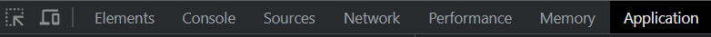
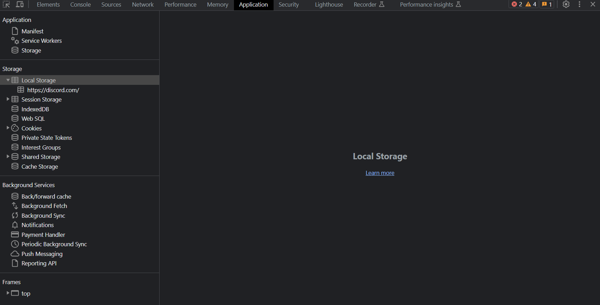
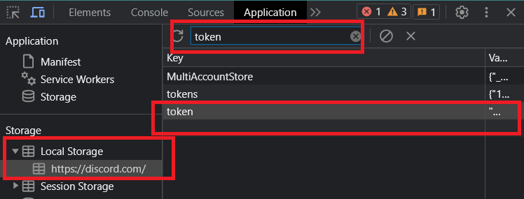
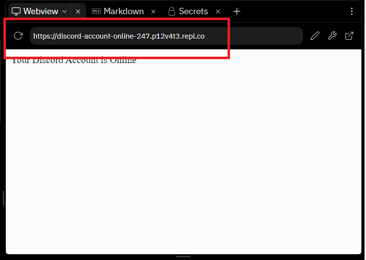
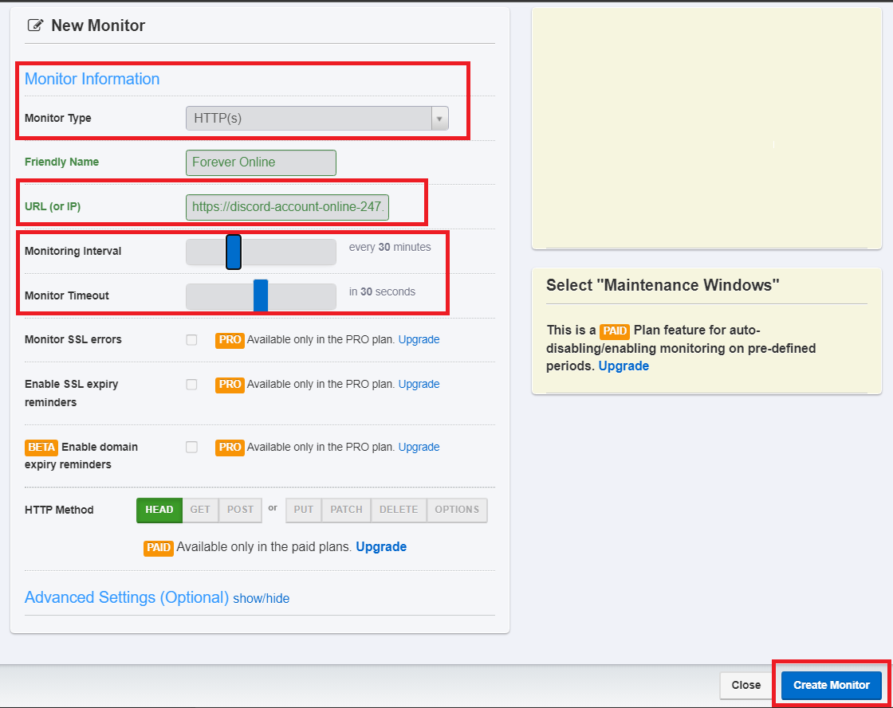

# Make your discord account online forever/(24*7) 
(This method no longer works, but can be used on different online Python IDE)

## [Fork My Replit Repo](https://replit.com/@p12v4t3/Discord-Account-Online-247)
## How to get your discord account's token?
1. Open Browser and visit [discord.com](https://discord.com/app)
2. Hit ctrl+shift+i to open inspect panel. Head towards application>local storage

3. You should a similar interface like this 
4. Click on https://discord.com/ and it should show all the details of your account towards the right side
5. 
   Search *token* in Filter option, something similar will show up like the above image.
6. Open the token (select the *token* option only from amongst tokens, and any other attributes) as shown as above and copy the token

***Note if you have multiple account logged into the same browser multiple tokens might be displayed***

## Adding your token on replit
After [forking](https://replit.com/@p12v4t3/Discord-Account-Online-247) this replit follow these steps:
1. **Tools > Secrets > Add New Secret**
2. Give the Key Name as '**TOKEN**' & pass in your token value, that was previously fetch by us as the *value*.

## Last step Hit Run & a web window will be displayed!

1. Copy this link and visit [UPTIMEROBOT](https://uptimerobot.com/)
2. Add new monitor & configure your monitor the same as I did
   
